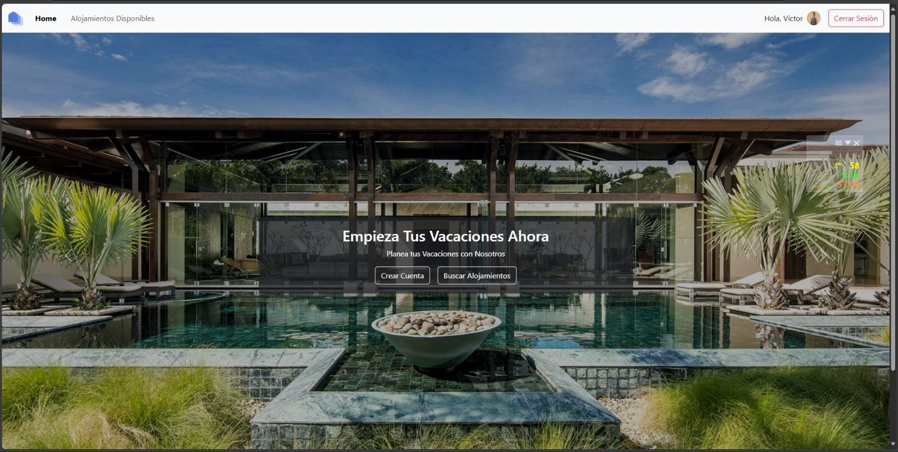
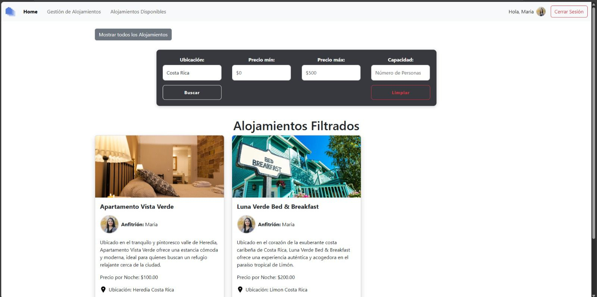

# 🏡 Home Away

**Home Away** es una plataforma web que conecta personas que buscan hospedaje temporal con propietarios que desean ofrecer sus alojamientos. Permite gestionar tanto la experiencia de huéspedes como de anfitriones de forma segura, clara y organizada.

---

## 🚀 Funcionalidades Principales

- Registro y autenticación de usuarios con roles diferenciados (huésped y propietario)
- Creación, edición y eliminación de publicaciones de alojamientos
- Sistema de roles para control de acceso y seguridad
- Filtros avanzados para buscar alojamientos según preferencias
- Carga de imágenes y videos para alojamientos
- **Almacenamiento de archivos multimedia en Firebase**, para evitar saturar la base de datos
- **Pantallas exclusivas según el rol del usuario**:
  - Los **huéspedes** verán pantallas diseñadas para buscar, filtrar y reservar alojamientos.
  - Los **propietarios** tendrán pantallas específicas para gestionar y editar sus alojamientos, así como gestionar reservas.

---

## 🖼️ Vista previa del proyecto

### Página principal


### Filtro de búsqueda


---

## 🛠️ Tecnologías utilizadas

- **Java** con **Maven**
- **Spring Boot** para la lógica de negocio y APIs REST
- **Thymeleaf** como motor de plantillas HTML
- **Spring Security** para autenticación y control de acceso
- **Firebase Storage** para guardar imágenes y videos externos

---

## ⚙️ Cómo ejecutar el proyecto

```bash
# Clonar el repositorio
git clone https://github.com/tu-usuario/DesarrolloWebG4.git
cd home-away

# Ejecutar desde tu IDE con soporte para Spring Boot
# o desde terminal
./mvnw spring-boot:run
